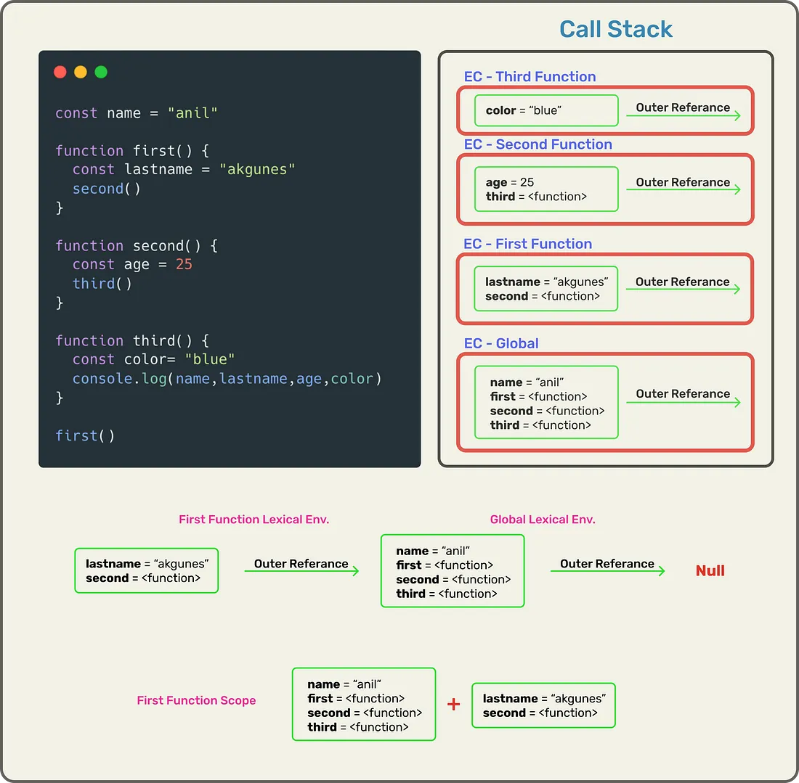

# Understanding Scope and Scope Chain in JavaScript

## What is Scope?

Scope in JavaScript refers to the accessibility or visibility of variables. That is, which parts of a program have access to the variable or where the variable is visible.

**_ Why is Scope Important? _**

- The main benefit of scope is security. that is, the variable can be accessed from only a certain area of program. Using a SCope, we can avoid unintended modificaions to the variables from other parts of program.

- The Scope also reduces the namespace collisions. That is, we can use the same variable names in different scopes.

## Types of Scope

1. Global Scope : Any variable that is not inside any function or block( a pair of curly braces), is insid the global scope. The variables in global scope can be accessed from anywhere in the program.

```bash
var globalVar = "I'm a global variable";

function checkScope() {
    console.log(globalVar); // Accessible
}

checkScope();
console.log(globalVar); // Accessible

```

2. Local Scope / Function Scope : Variables declare inside the local scope. They can only be accessed from within that function, that means they cannot be accessed from the outside code.

```bash
function checkScope() {
    var localVar = "I'm a local variable";
    console.log(localVar); // Accessible
}

checkScope();
console.log(localVar); // Uncaught ReferenceError: localVar is not defined

```

3. Block Scope : ES6 introduced _let_ and _const_ variables, unlike _var_, they can be scoped to the nearest pair of curly braces. That means, they can't be accessed from outside that pair of curly braces.

```bash
if (true) {
    let blockScopedVar = "I'm block scoped";
    console.log(blockScopedVar); // Accessible
}

console.log(blockScopedVar); // Uncaught ReferenceError: blockScopedVar is not defined

```

- Variables declared with var do not have block scope; they are function-scoped or globally scoped.

4. Nested Scope : just like functions in Js, a scope can be nested inside another scope.

```bash
var name = 'Peter';
function greet() {
  var greeting = 'Hello';
  {
    let lang = 'English';
    console.log(`${lang}: ${greeting} ${name}`);
  }
}
greet();


```

Here we have 3 scopes nested within each other. First, the bock scope (created due to the _let_ variable) is nested inside the local or function scope which is in turn nested inside the global scope.

## Lexical Scope

Lexical Scope(also known as Static Scope) literally means the scope determined at the lexing time(generally referred to as compiling) rather thatn at runtime.

```bash
let number = 42;
function printNumber() {
  console.log(number);
}
function log() {
  let number = 54;
  printNumber();
}
// Prints 42
log();


```

Here the console.log(number) will always print 42 no matter from where the function printNumber() is called. This is different from languages with the dynamic scope where the console.log(number) will print different value depending on from where the function printNumber() is called.

- If the above code was written in a language that supports dynamic scoping, the console.log(number) would have printed 54 instead.

- Using lexical scope we can determine the scope of the variable just by looking at the source code. Whereas in the case of dynamic scoping the scope can’t be determined until the code is executed.

## Scope Chain

When a variable used in Js, the JS engine will try to find the variable's value in the current Scope. If it could not find the variable, it will look into the outer scope and will continue to do so until it finds the variable or reaches global Scope.

- If it still could not find the variable, it will either implicitly declare the variable in the global Scope(if not in strict mode) or return an error.

```bash
let foo = 'foo';
function bar() {
  let baz = 'baz';
  // Prints 'baz'
  console.log(baz);
  // Prints 'foo'
  console.log(foo);
  number = 42;
  console.log(number);  // Prints 42
}
bar();

```

- When the function bar() is executed, the JavaScript engine looks for the baz variable and finds it in the current scope. Next, it looks for foo variable in the current scope and it can’t find it there, so it looks for the variable in outer scope and finds it there (i.e global scope).

- After that, we assign 42 to the number variable, so the JavaScript engine looks for the number variable in the current scope and after that in the outer scope.

- If the script is not in strict mode, the engine will create a new variable named number and assign 42 to it or return an error (if not in strict mode).

- So when a variable is used the engine will traverse the scope chain until it finds the variable.



## What is Lexical Enc?

A lexical environment is a structure that holds identifier-variable, mapping. (here identifier refers to the name of variables/functions, and the variable is the reference to actual object [including function object and array object] or primitive value).

- Simply put, a lexical environment is a place where variables and references to the objects are stored.

Lexical environment = EC of Local Memory + Reference to Lexical Env of it's parent

## Quick Sum-up

1. Lexical environment of it's parent is the scope where a function is physically present or defined.

2. Whenever a new EC is pushed in the call Stack it holds a reference to the lexical env of it's parent. That is, the execution Context memory from where it was invoked.

3. Global Execution Context holds reference to NULL.

4. JS engine first looks for the variable/function being accessed in the local scope of the function, and id not found, it keeps on searching the lexical environment of its parent until it finds the variable/function being accessed.

5. The Mechanism mentioned in point 4 is called Scope Chain.

6. If the variable accessed is not found in the scope chain, then you will get the variable is NOT DEFINED Error in console.
